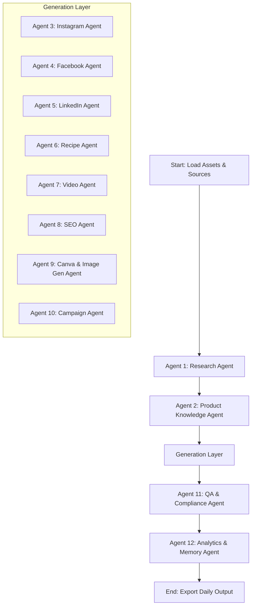

# Daily Multi-Agent Marketing Engine (12-Agent Production Setup)
**For: Roshini's Home Products | Platform: Google Antigravity 2.0**

---

## Trigger
**Scheduled Task** — Daily at 9:00 AM (local time)
Set this up in Antigravity via: `Schedule → New → Daily 9:00 AM`

Paste the following as your scheduled task prompt:
```
Run the Daily Content Engine for Roshini's Home Products. Follow the steps in `.antigravity/daily-content-engine.md` exactly.
```

---

## Step 1 — Load System Assets & Context

The orchestration engine reads and loads the following resources:
1. **Brand Voice & Style Rules:** `/brand-kit/color-guidelines.md` and `/brand-kit/style-guide.md`.
2. **Product Knowledge Base:** All files under `/knowledge-base/` (USP, ingredients, nutrition, recipes, faq, pricing).
3. **Calendar Triggers:** `/calendar/festivals.md` and `/calendar/campaigns.md` (detects if a festival is within the next 7 days or if a campaign is active).
4. **History Ledger:** `/history/previous-posts.md` (to ensure the hooks, recipes, and personas are rotated and not repeated from the last 30 days).

---

## Step 2 — Fetch Daily Sources

Scrape and collect raw research context from `/sources.md` (Web search keywords and target URLs).
1. Execute `google_search` for today's keywords (past 24h).
2. Fetch clean text from target industry and recipe URLs.
3. Save raw context locally to `today_raw_research.txt`.

---

## Step 3 — Orchestrate the 12-Agent Pipeline

To produce high-conversion, brand-safe, and SEO-optimized daily outputs, Antigravity coordinates **12 specialized agents** in a structured sequence:



### 1. Research Agent
- **Responsibility:** Parses the raw scraping folder, extracts the top 3 health/nutrition trends from today's sources, and provides a summarized daily research brief.

### 2. Product Knowledge Agent
- **Responsibility:** Validates the research brief against `/knowledge-base/ingredients.md` and `/knowledge-base/nutrition.md`. It translates raw science into simple family benefits, ensuring no false nutritional claims are made.

### 3. Instagram Agent
- **Responsibility:** Injects daily topic rotations (e.g. Millet Monday) and drafts:
  - 1 Instagram Caption (80-150 words).
  - Carousel copy (Slide 1 to 5).
  - Target call to action (CTA).

### 4. Facebook Agent
- **Responsibility:** Drafts warm, family-focused copy centered around child nutrition, school lunches, or senior health. Encourages comments and sharing.

### 5. LinkedIn Agent
- **Responsibility:** Focuses on corporate wellness, morning routines, mental focus, and slow-release energy for working professionals.

### 6. Recipe Agent
- **Responsibility:** Formulates one healthy recipe variant using Nutrimix. Rotates between Breakfasts, Smoothies, Kids' snacks, and desserts.

### 7. Video Agent (Reels/Shorts)
- **Responsibility:** Writes a 30-second Reel script structured as a grid with: Hook, visual scene description, voiceover copy, and on-screen text overlays.

### 8. SEO Agent
- **Responsibility:** Optimizes the daily blog article topic by writing the SEO Title (under 60 chars), Meta Description (140-160 chars), URL slug, targeted keywords, and structured FAQ Schema.

### 9. Canva & Image Gen Agent
- **Responsibility:**
  - **Design Layouts:** Generates exact styling briefs for the graphic designer (font sizing, hex codes, layouts, and icons).
  - **Visual Prompts:** Formulates specific visual image prompts for the AI art generator based on the drafted post contents.
  - **Image Generation:** Executes the `generate_image` tool using the generated prompts to create 2 high-quality marketing images (e.g., product mockups, kitchen scenes, or plated recipes). Saves them under `e:\Roshinis\AI_Content\outputs\images\YYYY-MM-DD_post_1.png` and `e:\Roshinis\AI_Content\outputs\images\YYYY-MM-DD_post_2.png`.

### 10. Campaign Agent
- **Responsibility:** Checks `/calendar/festivals.md` and `/calendar/campaigns.md`. If a promotion or festival is active, it modifies CTAs and posts to include custom discount codes (e.g. `FIRST10`) and seasonal copy hooks.

### 11. QA & Compliance Agent (Validation Layer)
- **Responsibility:** Reviews the output of all preceding agents:
  - Checks for grammar and spelling.
  - Ensures voice consistency (warm, educational, honest).
  - Verifies FSSAI compliance (flags any medical cure claims).
  - Checks history database to ensure no hook, recipe, or target persona is duplicated.

### 12. Analytics & Memory Agent
- **Responsibility:** Adjusts final post hook styles based on previous week's performance data. At the end of the run, it automatically appends today's hooks and tags to `/history/previous-posts.md`.

---

## Step 4 — Export & Log
1. **Merge** all verified output segments into a single markdown file named `YYYY-MM-DD-multi-source-content.md` under `/outputs/`.
2. **Embed Generated Images:** Insert absolute local paths/markdown links of the generated images from `/outputs/images/` directly into the Instagram caption and blog post sections of the merged markdown file.
3. **Include summary metadata** at the beginning: Active rotation day, target customer persona chosen for today, campaign codes used, and links to the generated image files.
4. **Purge** the temporary research briefs and cache files.
