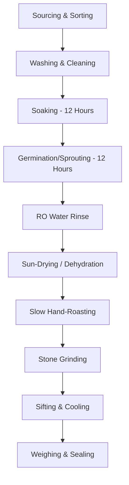

# The Manufacturing Process: Traditional Small-Batch Preparation

Our manufacturing process is designed to respect traditional preparation methods while maintaining strict hygiene and safety standards. This slow, careful process ensures maximum nutritional bioavailability and freshness.

---

## 1. Step-by-Step Preparation Cycle

### Step 1: Sourcing & Sorting
- All grains, nuts, and seeds are hand-sorted to remove stones, chaff, and damaged pieces. Only clean, whole grains are processed.

### Step 2: Washing & Cleaning
- Grains are washed thoroughly in clean, running water 3 to 4 times to remove dirt and surface impurities.

### Step 3: Soaking (12 Hours)
- Sorted grains are soaked in clean RO-filtered water in food-grade stainless steel containers for 12 hours. This starts the germination sequence.

### Step 4: Sprouting / Germination (12 Hours)
- The soaked water is drained. The grains are tied in clean, sanitized cotton cloths (muslin bags) and suspended in a warm, dark cabinet to sprout for 12 hours. Sprouting breaks down phytic acid (an anti-nutrient) and unlocks essential minerals.

### Step 5: Sun-Drying & Dehydration
- Sprouted grains are rinsed with RO water and spread evenly on sanitized elevated trays under direct sunlight to dry completely. This process takes 1 to 2 days, reducing moisture content below 5% to ensure a long natural shelf life.

### Step 6: Slow Hand-Roasting
- The dried sprouted grains, raw nuts, and seeds are roasted separately in heavy-bottomed iron pans (kadhai) on a low-medium flame. Hand-roasting is done slowly to develop a rich, nutty aroma without scorching the grains, locking in vitamins.

### Step 7: Traditional Stone Grinding
- Once cooled, the roasted ingredients are ground using slow-speed stone mills. Slow grinding prevents the generation of excessive heat (common in commercial high-speed steel mills) which can denature sensitive vitamins, healthy oils, and active enzymes.

### Step 8: Cooling, Sifting & Packaging
- The ground flour is allowed to cool to room temperature, sifted to remove coarse husks, and immediately weighed into food-grade, moisture-proof stand-up pouches with zip locks. Each pouch is heat-sealed to preserve freshness.

---

## 2. Why Our Process Matters

- **Anti-Nutrients Deactivated:** Raw millets contain phytic acid and tannins that bind to calcium, iron, and zinc, blocking absorption. Our 12-hour sprouting process naturally activates phytase, breaking down these anti-nutrients and increasing mineral bioavailability by up to 300%.
- **Gluten-Free Safety:** We do not grind wheat or gluten-containing grains in our facility, completely avoiding cross-contamination.
- **No Heat Damage:** Traditional stone grinding operates at low speeds and temperatures, preserving delicate nutrients like Vitamin B, Vitamin E, and healthy fats.
- **Freshness Guarantee:** We roast and grind in small batches of 5–10 kg to fulfill recent orders, never storing stale stock on shelves.
